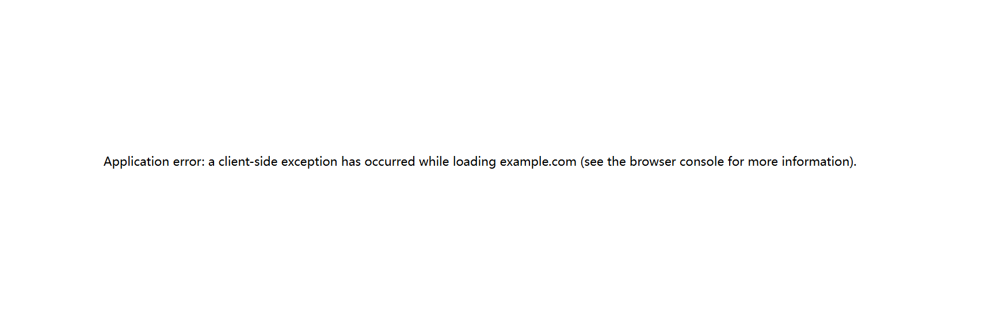

<div align="left">
  <a href="./README_CN.md">简体中文</a>
</div>

# Translate Crash Fix - Chrome Extension

This Chrome extension fixes the long-standing compatibility issues between Google Translate(including other translation plugins) and React (and other modern JavaScript frameworks) that have been plaguing user and developers since 2018.

## The Problem

Google Translate breaks React applications by:

1. **DOM Manipulation Conflicts**: Google Translate wraps translated text in `<font>` tags, changing the parent-child relationships that React relies on
2. **Text Node Disruption**: Moving and replacing text nodes breaks React's virtual DOM reconciliation
3. **Event Target Issues**: DOM changes make `event.target` unreliable
4. **Normalization Problems**: DOM tree normalization breaks React's text node boundaries

This results in errors like:
```
Application error: a client-side exception has occurred while loading xxx.com (see the browser console for more information).
```

or
```
DOMException: Failed to execute 'removeChild' on 'Node': The node to be removed is not a child of this node.
```

## Features

✅ **Prevents React Crashes**: solves the "a client-side exception has occurred while loading" errors  
✅ **Framework Agnostic**: Works with React, Vue, Angular, Svelte, and others  
✅ **Zero Configuration**: Works automatically after installation  
✅ **Performance Optimized**: Minimal overhead, only activates when needed  
✅ **Debug Interface**: Popup shows status and debug information  
✅ **Error Recovery**: Gracefully handles edge cases and provides fallbacks  

## Compatibility

- **Chrome Version**: 88+ (Manifest V3)
- **Websites**: All websites (activates automatically)
- **Frameworks**: React, Vue, Angular, Svelte, Solid.js, and others
- **Google Translate**: All translation features work normally

## The Solution

This extension provides a comprehensive fix by:

- **Patching DOM Methods**: Safely handles `removeChild`, `insertBefore`, `replaceChild` operations
- **Error Boundary Protection**: Catches and handles DOM manipulation errors gracefully
- **Translation Detection**: Identifies Google Translate activity and adjusts behavior accordingly
- **Text Node Preservation**: Maintains original DOM structure where possible
- **Framework Agnostic**: Works with React, Vue, Angular, and other modern frameworks

## Installation

### From Source (Development)

1. Download or clone this repository
2. Open Chrome and navigate to `chrome://extensions/`
3. Enable "Developer mode" in the top right
4. Click "Load unpacked" and select the extension directory
5. The extension will be loaded and active on all websites


## How It Works

### 1. Early Injection
The extension injects its fix script at `document_start` to ensure it runs before Google Translate or React.

### 2. DOM Method Patching
```javascript
// Example of how the extension patches DOM methods
Node.prototype.removeChild = function(child) {
  try {
    if (!this.contains(child)) {
      return child; // Safely handle missing nodes
    }
    return originalRemoveChild.call(this, child);
  } catch (error) {
    // Handle Google Translate conflicts gracefully
    return child;
  }
};
```

### 3. Translation Detection
The extension detects Google Translate activity by:
- Monitoring for `translate_m.js` in stack traces
- Checking for `window.google.translate`
- Identifying characteristic DOM patterns

### 4. Safe Fallbacks
When DOM operations fail, the extension provides safe fallbacks:
- `removeChild` errors are ignored when the node isn't actually a child
- `insertBefore` falls back to `appendChild` when reference nodes are missing
- `replaceChild` attempts append operations when replacement fails

## Troubleshooting

### Extension Not Working

1. Check that the extension is enabled in `chrome://extensions/`
2. Refresh the page after installing the extension
3. Check the extension popup for status information

### Reporting Issues

If you encounter issues:

1. Note the specific website and steps to reproduce
2. Check the browser console for error messages
3. Include the extension popup debug information
4. Test with the extension temporarily disabled to confirm it's related

## Advanced Configuration

The extension exposes debug information at `window.__reactGoogleTranslateFixDebug` for advanced users:

```javascript
// Access debug information in browser console
console.log(window.__reactGoogleTranslateFixDebug);
```

## Contributing

This extension addresses a critical compatibility issue that has affected countless developers. Contributions are welcome:

1. Test the extension on various React applications
2. Report compatibility issues with specific websites
3. Suggest improvements to the DOM patching logic
4. Help with additional framework testing

## Technical Details

### Why This Approach Works

Unlike previous solutions that focused only on the `<font>` tag issue, this extension addresses the root cause: DOM manipulation conflicts between Google Translate and virtual DOM libraries.

The key insights:

1. **Error Prevention vs. Error Recovery**: Instead of trying to prevent Google Translate from modifying the DOM, we make the modifications safe
2. **Graceful Degradation**: When operations fail, we provide sensible fallbacks rather than crashing
3. **Context Awareness**: We detect Google Translate context and adjust behavior accordingly
4. **Comprehensive Coverage**: We patch all relevant DOM methods, not just the obvious ones

### Performance Impact

The extension has minimal performance impact:
- Only activates when DOM manipulation errors occur
- Uses WeakMap and WeakSet for efficient memory management
- Avoids unnecessary DOM traversals
- Patches are lightweight wrappers around native methods

## Version History

- **v1.1.0**: Current version with comprehensive DOM manipulation fixes

## License

MIT License - Feel free to use, modify, and distribute.

---

**Note**: This extension solves a 6-year-old compatibility issue between Google Translate and modern JavaScript frameworks. It's designed to be a temporary solution until Google addresses the root cause in Chrome itself.
