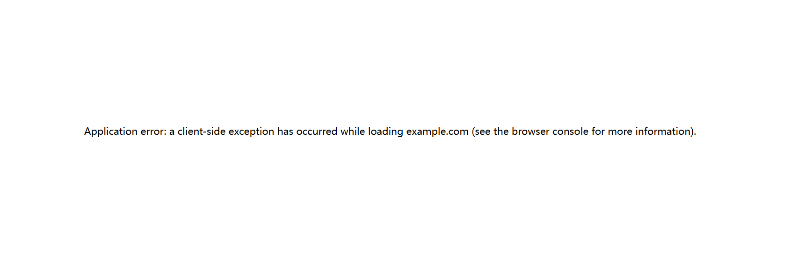

<div align="left">
  <a href="./README.md">English</a>
</div>

# 网页翻译崩溃修复 - Chrome 扩展

这个 Chrome 扩展修复了 Google翻译（包括其他翻译插件）与 React（和其他现代 JavaScript 框架）之间长期存在的兼容性问题，这些问题自 2018 年以来一直困扰着用户和开发者。

## 问题描述

Google 翻译通过以下方式破坏 React 应用程序：

1. **DOM 操作冲突**：Google 翻译将翻译后的文本包装在 `<font>` 标签中，改变了 React 依赖的父子关系
2. **文本节点破坏**：移动和替换文本节点破坏了 React 的虚拟 DOM
3. **事件目标问题**：DOM 更改使 `event.target` 不可靠
4. **标准化问题**：DOM 树标准化破坏了 React 的文本节点边界

这会导致如下网页崩溃白屏并显示如下错误：

```
应用程序错误：加载 xxx.com 时发生客户端异常（有关更多信息，请参阅浏览器控制台）。
```
或
```
DOMException: 在 'Node' 上执行 'removeChild' 失败：要删除的节点不是此节点的子节点。
```

## 功能特性

✅ **防止翻译网页崩溃**：消除"加载时发生客户端异常"错误  
✅ **框架无关**：适用于 React、Vue、Angular、Svelte 等  
✅ **零配置**：安装后自动工作  
✅ **性能优化**：最小开销，仅在需要时激活  
✅ **调试界面**：弹出窗口显示状态和调试信息  
✅ **错误恢复**：优雅处理异常情况并提供回退  

## 兼容性

- **Chrome 版本**：88+（Manifest V3）
- **网站**：所有网站（自动激活）
- **框架**：React、Vue、Angular、Svelte、Solid.js 等
- **插件**：Google 翻译及所有翻译插件功能正常工作

## 解决方案

此扩展通过以下方式提供全面修复：

- **修补 DOM 方法**：安全处理 `removeChild`、`insertBefore`、`replaceChild` 操作
- **错误边界保护**：优雅地捕获和处理 DOM 操作错误
- **翻译检测**：识别 Google 翻译活动并相应调整行为
- **文本节点保护**：尽可能保持原始 DOM 结构
- **框架无关**：适用于 React、Vue、Angular 和其他现代框架

## 安装

### 浏览器官方商店

  - [x] Edge [点击此处去安装](https://microsoftedge.microsoft.com/addons/detail/nljanbkbbghffgfmafgifpfkajihocfp)
  - [ ] Chrome 审核中，即将上线......
  - [ ] Safari 暂无计划.

### 从源码安装（开发）

1. 下载或克隆此仓库
2. 打开 Chrome 并导航到 `chrome://extensions/`
3. 在右上角启用"开发者模式"
4. 点击"加载已解压的扩展程序"并选择扩展目录
5. 扩展将在所有网站上加载并激活

## 工作原理

### 1. 早期注入
扩展在 `document_start` 时注入其修复脚本，确保在 Google 翻译或 React 之前运行。

### 2. DOM 方法修补
```javascript
// 扩展如何修补 DOM 方法的示例
Node.prototype.removeChild = function(child) {
  try {
    if (!this.contains(child)) {
      return child; // 安全处理缺失的节点
    }
    return originalRemoveChild.call(this, child);
  } catch (error) {
    // 优雅地处理 Google 翻译冲突
    return child;
  }
};
```

### 3. 翻译检测
扩展通过以下方式检测 Google 翻译活动：
- 监控堆栈跟踪中的 `translate_m.js`
- 检查 `window.google.translate`
- 识别特征性 DOM 模式

### 4. 安全回退
当 DOM 操作失败时，扩展提供安全回退：
- 当节点实际上不是子节点时，忽略 `removeChild` 错误
- 当引用节点缺失时，`insertBefore` 回退到 `appendChild`
- 当替换失败时，`replaceChild` 尝试追加操作

## 故障排除

### 扩展不工作

1. 检查扩展是否在 `chrome://extensions/` 中启用
2. 安装扩展后刷新页面
3. 检查扩展弹出窗口的状态信息

### 报告问题

如果遇到问题：

1. 记录具体网站和重现步骤
2. 检查浏览器控制台的错误消息
3. 包含扩展弹出窗口的调试信息
4. 临时禁用扩展进行测试以确认相关

## 高级配置

扩展在 `window.__reactGoogleTranslateFixDebug` 处公开调试信息，供高级用户使用：

```javascript
// 在浏览器控制台中访问调试信息
console.log(window.__reactGoogleTranslateFixDebug);
```

## 贡献

此扩展解决了一个影响无数开发者的关键兼容性问题。欢迎贡献：

1. 在各种 React 应用程序上测试扩展
2. 报告特定网站的兼容性问题
3. 建议改进 DOM 修补逻辑
4. 帮助进行额外的框架测试

## 技术细节

### 为什么这种方法有效

与之前只关注 `<font>` 标签问题的解决方案不同，此扩展解决了根本原因：Google 翻译与虚拟 DOM 库之间的 DOM 操作冲突。

关键见解：

1. **错误预防 vs 错误恢复**：我们不是试图阻止 Google 翻译修改 DOM，而是使修改变得安全
2. **优雅降级**：当操作失败时，我们提供合理的回退而不是崩溃
3. **上下文感知**：我们检测 Google 翻译上下文并相应调整行为
4. **全面覆盖**：我们修补所有相关的 DOM 方法，而不仅仅是明显的方法

### 性能影响

扩展具有最小的性能影响：
- 仅在发生 DOM 操作错误时激活
- 使用 WeakMap 和 WeakSet 进行高效内存管理
- 避免不必要的 DOM 遍历
- 修补是围绕原生方法的轻量级包装器

## 版本历史

- **v1.1.0**：具有全面 DOM 操作修复的当前版本

## 许可证

MIT 许可证 - 可自由使用、修改和分发。

---

**注意**：此扩展解决了 Google 翻译与现代 JavaScript 框架之间 6 年之久的兼容性问题。它被设计为临时解决方案，直到 Google 在 Chrome 本身中解决根本原因。


